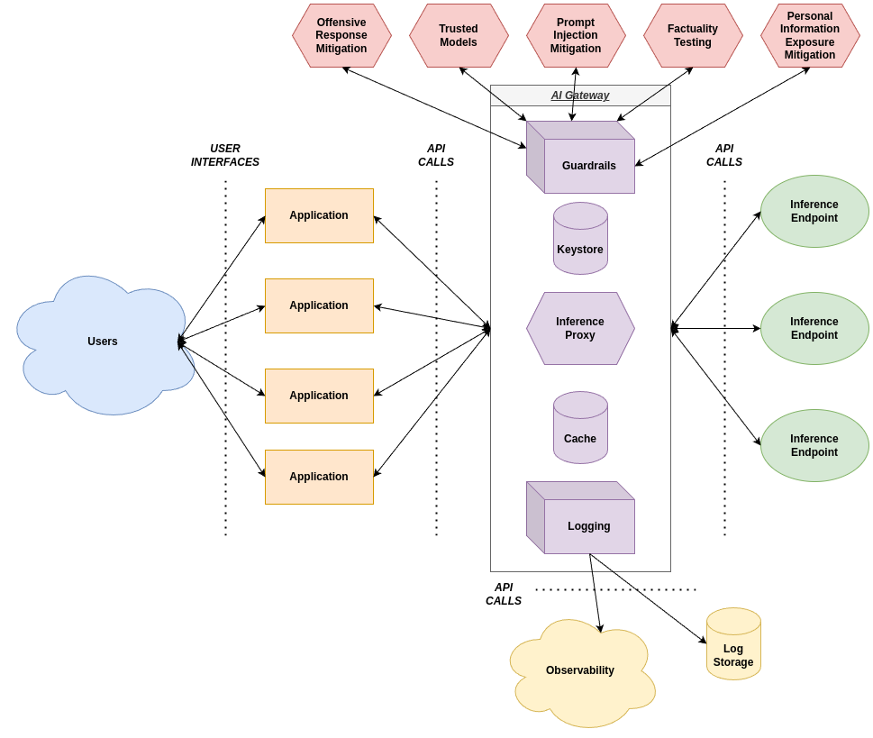

# aigateway.lib.unb.ca
<center><a href="assets/aigateway.png"></a></center>

## Overview
aigateway.lib.unb.ca is a Rust-based application that acts as a reverse proxy, forwarding incoming HTTP requests from applications to appropriate inference endpoints.

As the number of AI-driven applications grows in an organization, the need for a centralized proxy to standardize, manage, regulate and route requests quickly becomes necessary. This application is designed to be a lightweight, performant, and easily configurable solution to this need.

## Features

- **Reverse Proxies Requests**: Proxies requests to backend services.
- **Multiple Endpoints**: Configurable endpoints provide access to needed inferences. 
- **Key-Based Validation**: API key set atomic inference endpoint permissions.
- **Observability**: Detailed, actionable logging can be ingested into observability solutions (currently: NewRelic).
- **Caching**: Configurable caches to reduce latency and improve performance.
- **Rate Limiting**: Limits the number of requests to an endpoint to prevent abuse.
- **Guardrails**: Provides guardrails to mitigate negative outcomes.
- **Http2 Support**: Supports HTTP/2.

## Development Status
This application is currently in development.

## Configuration
The application uses a JSON configuration file located at `data/config.json`. Below is an example configuration:

```json
{
  "port": 3000,
  "adapter": "127.0.0.1",
  "endpoints": {
    "/api/v2": {
        "adapter": "deckard_llm_v1",
        "url": "http://lib.unb.ca"
    }
  },
  "logging": "newrelic",
  "license_key": "YOURKEY",
  "messages": {
    "auth_failure": "Unauthorized or forbidden endpoint access"
  }
}
```

## Usage
As this application is currently in development, binaries are not currently being packaged/released. Commands should be run via cargo for now.

### Generating an Authorization Keypair
To generate an authorization keypair, use the following command:

```bash
cargo build --release; RUST_LOG=info cargo run -- generate-key
```

### Running the Server
To run the server, use the following command:

```bash
cargo build --release; RUST_LOG=info cargo run -- start-server
```

## Detailed Logging
General logging is printed to stdout/stder. Detailed logging can be sent to NewRelic by setting the `logging` key in the configuration file to `newrelic` and providing a valid `license_key`.

## License
- As part of our 'open' ethos, UNB Libraries licenses its applications and workflows to be freely available to all whenever possible.
- Consequently, the contents of this repository [unb-libraries/aigateway.lib.unb.ca] are licensed under the [MIT License](http://opensource.org/licenses/mit-license.html). This license explicitly excludes:
   - Any content, which remains the exclusive property of its author(s).
   - The UNB logo and any of the associated suite of visual identity assets, which remains the exclusive property of the University of New Brunswick.
