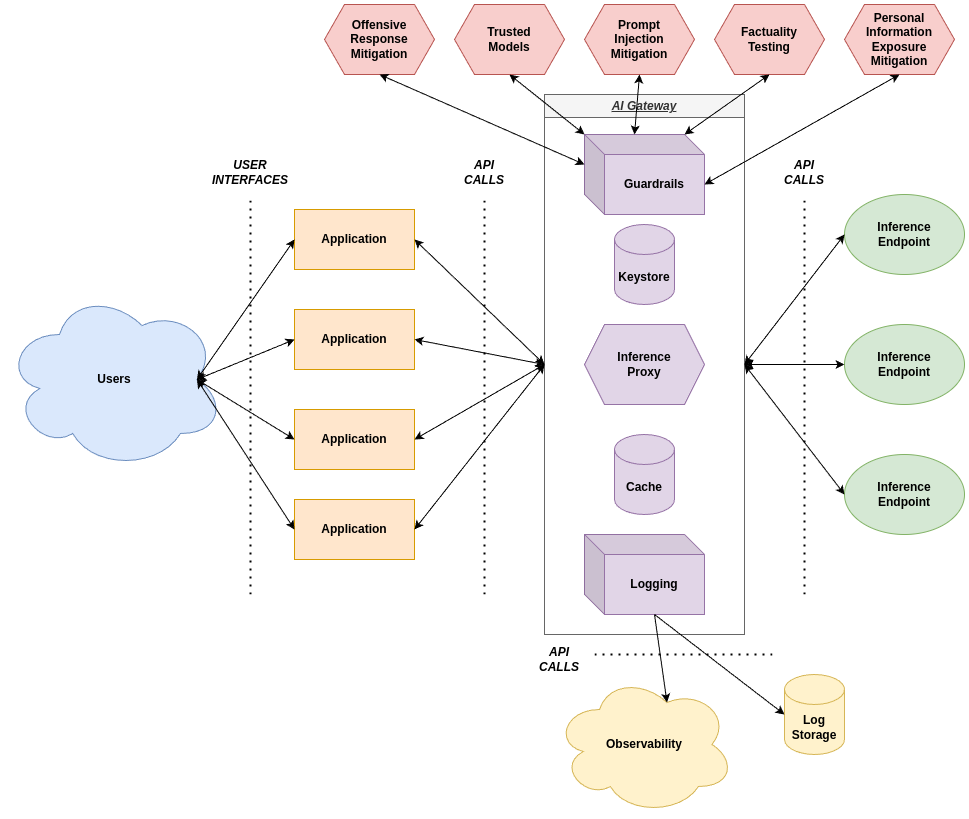

# aigateway.lib.unb.ca
<center><a href="assets/aigateway.png"></a></center>

## Overview
aigateway.lib.unb.ca is a Rust-based application that functions as a reverse proxy, channeling incoming HTTP requests from applications to the appropriate inference endpoints.

As the number of AI-driven applications increases within an organization, the necessity for a centralized proxy to quickly standardize, manage, regulate, and swiftly route requests becomes evident. This application is crafted to be a lightweight, high-performance, and easily configurable solution to this requirement.

## Features

- **Reverse Proxy Requests**: Proxies requests to backend services.
- **Multiple Endpoints**: Configurable endpoints provide access to necessary inferences.
- **Key-Based Validation**: API key sets atomic inference endpoint permissions.
- **Observability**: Detailed, actionable logging can be integrated into observability solutions (currently: NewRelic).
- **Caching**: Configurable caches reduce latency and enhance performance.
- **Rate Limiting**: Limits the number of requests to an endpoint to prevent abuse.
- **Guardrails**: Provides guardrails to mitigate adverse outcomes.
- **HTTP/2 Support**: Supports HTTP/2.

## Development Status
This application is presently under development.

## Configuration
The application is configured via a JSON configuration file at `data/config.json`. Below is an example configuration:

```json
{
  "port": 3000,
  "adapter": "127.0.0.1",
  "endpoints": {
    "/api/v2": {
        "adapter": "deckard_llm_v1",
        "url": "http://lib.unb.ca"
    }
  },
  "logging": "newrelic",
  "license_key": "YOURKEY",
  "messages": {
    "auth_failure": "Unauthorized or forbidden endpoint access"
  }
}
```

## Usage
### Gateway
#### Generating an Authorization Keypair
To create an authorization keypair, use the following command:

```bash
./gateway generate-key
```

#### Running the Server
To run the server, use the following command:

```bash
./gateway start-server
```

## Docker
A docker image is provided for convenience.

### Client Requests
The gateway forwards all data in the POST requests to the configured endpoint while checking the client's authorization credentials in the ```x-pub-key``` and ```x-api-key``` header fields. Example use:

```
curl \
  -H "x-pub-key: 2e8db65a-9050-4418-8867-bde29c52618e" \
  -H "x-api-key: ec6a8c0c-df3c-4ba0-b2d0-32d2fd564afb" \
  -H "Content-Type: application/json" \
  --request POST \
  --data '{"query":"Who was the architect of M. Patrick Gillin Hall","context":"","pipeline":"libpages"}' \
  https://aigateway.lib.unb.ca/deckard/api/v1
```

## Logging
### General
General logging is printed to stdout/stderr. Verbose logging can be enabled by setting `RUST_LOG=info` in your shell.

### Detailed
Detailed logging can be sent to [NewRelic](https://newrelic.com/) by setting the `logging` key in the configuration file to `newrelic` and supplying a valid `license_key`.

## License
- In line with our 'open' ethos, UNB Libraries makes its applications and workflows freely available to everyone whenever possible.
- As a result, the contents of this repository [unb-libraries/aigateway.lib.unb.ca] are licensed under the [MIT License](http://opensource.org/licenses/mit-license.html). This license explicitly excludes:
   - Any content that remains the exclusive property of its author(s).
   - The UNB logo and any associated visual identity assets remain the exclusive property of the University of New Brunswick.
